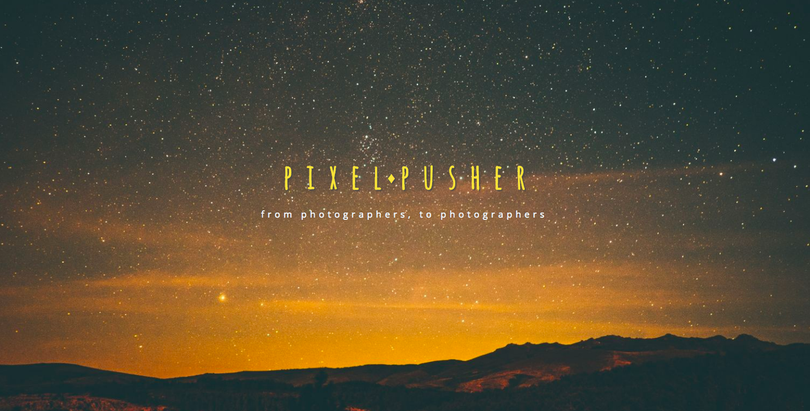
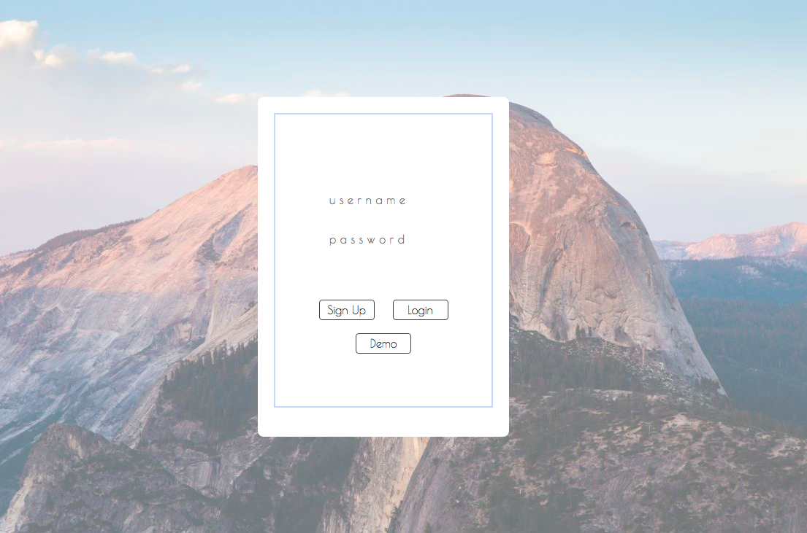

# Pixel Pusher

[Pixel Pusher live][pixel pusher]

[pixel pusher]: https://pixelpusher.herokuapp.com/

Pixel Pusher is a full-stack web application inspired by 500px. It utilizes Ruby on Rails on the backend, a PostgreSQL database, javascript and React.js with a Redux architectural framework on the frontend.

## Features

  * User accounts with secure authentication

  * Photo detailed View

  * Upload photos

  * Discover photos

  * Modal components

----
### Overview

  * Users can discover new users through the home page.

  * User can click into profiles of photographers they like.

  * Users can upload high resolution photos.

  * Uploaded photos appear on the user's profile page in a grid format
----
### Landing Page

  * The landing page features a splash image that changes when hovered over welcome message.

  
  

  * Users can login or signup at the lower left page of homepage, or demo the site with a guest login. The Auth Modal-like window features two form-types that can be toggled between from within each modal. An author authentication modal will pop up if user tried to access a user's profile when logged out.

  

### User Home Feed

  * Users can discover photos in the home page.

  

  * Photos can be enlarged by clicking on them and viewed in a dedicated Modal displaying the photo title, and author.

  

### User Profile

  * Comes with a default profile photo on sign up.

  

  * Uploaded photos appear in a grid below the user's information

  

______
## Future Directions
  * Optimize page load with an infinite scroll

  * Users can like other users photos

  * Photos can have different discover by category pages.

  * User can edit personal profile

  * User can follow other photographers

___

See the development [README][readme] for a list of components, wireframes, sample state, and DB schema.

[readme]: docs/README.md
